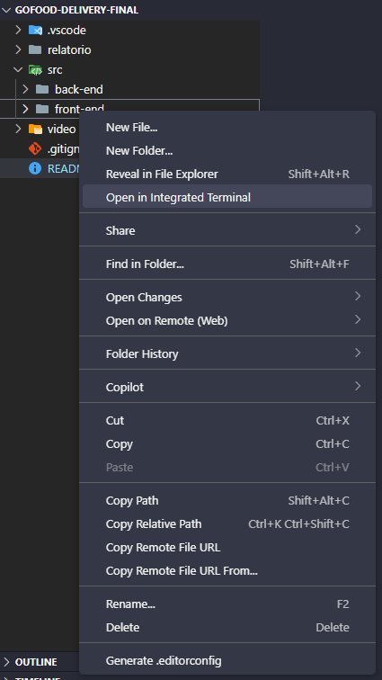
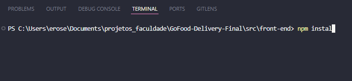
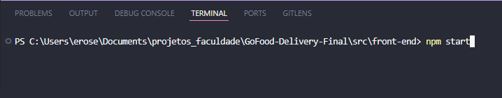
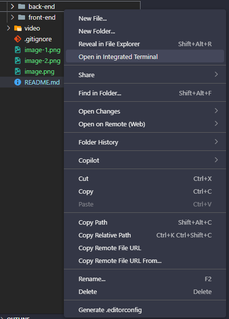
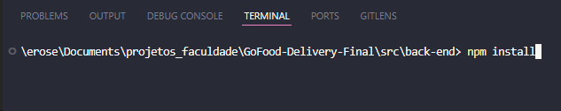
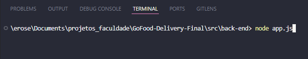

# Como Rodar o Projeto (Front-end e Back-end)

Este tutorial guiará você pelos passos para configurar e rodar tanto o front-end quanto o back-end do projeto.

## Pré-requisitos

Antes de começar, certifique-se de que sua máquina tenha a última versão do Node.js instalada. Você pode baixá-la no link oficial: [https://nodejs.org/pt](https://nodejs.org/pt)

## Passos para Rodar o Projeto

1.  **Baixe a IDE VS Code:**
    Caso ainda não tenha, faça o download e instale o Visual Studio Code (VS Code), uma IDE popular para desenvolvimento. Você pode baixá-lo em [https://code.visualstudio.com/](https://code.visualstudio.com/).

2.  **Abra o Projeto no VS Code:**
    Abra o VS Code e, no menu superior, vá em `File` (Arquivo) > `Open Folder` (Abrir Pasta). Navegue até a pasta raiz do seu projeto e selecione-a.

### Rodando o Front-end

1.  **Abra o Terminal Integrado na Pasta Correta:**
    No explorador de arquivos do VS Code (geralmente no lado esquerdo), navegue até a pasta `src/front-end`. Clique com o botão direito do mouse sobre a pasta `front-end` e selecione `Open in Integrated Terminal` (Abrir no Terminal Integrado).

    

2.  **Instale as Dependências do Front-end:**
    Com o terminal integrado aberto na pasta `src/front-end`, digite o seguinte comando e pressione Enter:

    ```bash
    npm install
    ```
    

    Este comando irá baixar e instalar todas as dependências necessárias para o projeto front-end. Aguarde até que o processo seja concluído.

3.  **Inicie o Front-end:**
    Após a conclusão da instalação das dependências, digite o seguinte comando no terminal e pressione Enter:

    ```bash
    npm start
    ```
    

    Este comando irá iniciar o servidor de desenvolvimento do front-end. O projeto deverá abrir automaticamente no seu navegador padrão. Se não abrir, verifique o terminal para o endereço (URL) onde o projeto está sendo executado (geralmente `http://localhost:3000`).

### Rodando o Back-end

1.  **Abra um Novo Terminal Integrado para o Back-end:**
    No VS Code, você pode abrir um novo terminal indo em `Terminal` > `New Terminal` (Novo Terminal) ou usando o atalho `Ctrl+'` (crase). Alternativamente, no explorador de arquivos do VS Code, clique com o botão direito do mouse sobre a pasta `back-end` e selecione `Open in Integrated Terminal` (Abrir no Terminal Integrado).

    

2.  **Instale as Dependências do Back-end:**
    Com o terminal integrado aberto na pasta `back-end`, digite o seguinte comando e pressione Enter:

    ```bash
    npm install
    ```
    

    Este comando irá baixar e instalar todas as dependências necessárias para o projeto back-end. Aguarde até que o processo seja concluído.

3.  **Inicie o Back-end:**
    Após a conclusão da instalação das dependências, digite o seguinte comando no terminal e pressione Enter:

    ```bash
    node app.js
    ```
    

    Este comando irá iniciar o servidor back-end. Você deverá ver mensagens no terminal indicando que o servidor foi iniciado e está ouvindo em uma porta específica (por exemplo, "Server running on port 3001" ou similar).

Parabéns! Você rodou o projeto completo (front-end e back-end) com sucesso.